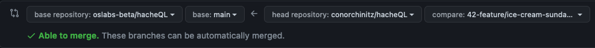

# Contribution Guide

Thank you for helping to maintain and improve HacheQL!

## Reporting Bugs

Before reporting a bug, please check the list of [open issues](https://github.com/oslabs-beta/hacheQL/issues) to see if it has already been reported. To report a new bug, open a [new issue](https://github.com/oslabs-beta/hacheQL/issues).

## Requesting Features

Before requesting a feature, please check the list of [open issues](https://github.com/oslabs-beta/hacheQL/issues) to see if the feature has already been requested. If it has, leave a comment to show your support for the idea. If you plan to implement the feature, say so in your comment.

To make a new feature request, open a [new issue](https://github.com/oslabs-beta/hacheQL/issues). If you plan to implement the feature, include a comment saying so.

## Getting Started

Before starting to work, check the [open issues](https://github.com/oslabs-beta/hacheQL/issues) to see if anyone is already working on the same bug/feature. If someone is, you can leave a comment offering to help, or you can pick a different issue to work on. If someone has claimed an issue but doesn't respond to your comments and hasn't left an update for two weeks, it's okay to start working on it yourself.

Once you've settled on an issue to work on:

1. Fork the project and clone the forked repo to your computer.
2. Add the main repo as an upstream remote.
```
git remote add upstream https://github.com/oslabs-beta/hacheQL.git
```
3. Run `npm install`.
4. Create your feature branch and give it a descriptive name. Begin the branch name with the ticket number of the issue you're working on.
  - Ex: `git checkout -b 42-feature/ice-cream-sundae-machine`
5. This project uses the [test-driven development](https://www.agilealliance.org/glossary/tdd/#q=~(infinite~false~filters~(postType~(~'page~'post~'aa_book~'aa_event_session~'aa_experience_report~'aa_glossary~'aa_research_paper~'aa_video)~tags~(~'tdd))~searchTerm~'~sort~false~sortDirection~'asc~page~1)) strategy. Please write tests for your bugfix/feature BEFORE implementing it. Before implementing the bugfix/feature, all your tests should fail. After implementing it, all your tests should pass.
  - Our test suite uses [Jest](https://jestjs.io/).
6. Write some code!
  - As you work, make frequent commits and leave comments on the Github issue about your progress.
  - Feel free to update the website to reflect a new feature, if it makes sense to do so. The source files are in the `/demo` directory.

## Making A Pull Request

1. Make sure that: 
 - your branch is up-to-date with the repo's main branch
 - `eslint` is not identifying style errors in your code
 - your code passes the test suite (you did add tests, right??)
4. If you've changed the API, please update [Documentation.md](DOCUMENTATION.md).
5. Commit your changes.
  - Ex: `git commit -m 'Add ice cream sundae machine'`
6. Push to your fork of the main repo.
  - Ex: `git push origin feature/ice-cream-sundae-machine`
7. Open a pull request on GitHub.


## License
By contributing, you agree that your contributions will be licensed under HacheQL's MIT License.